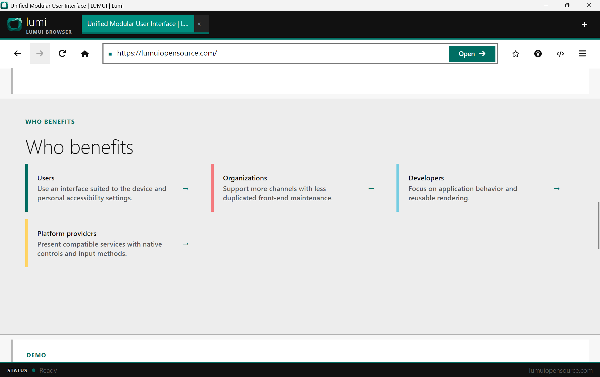
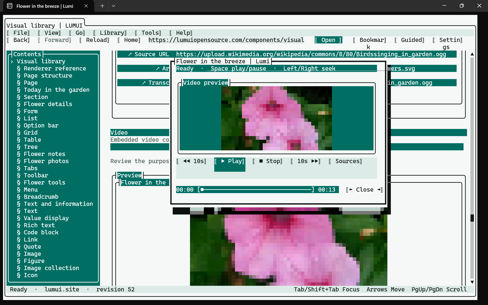
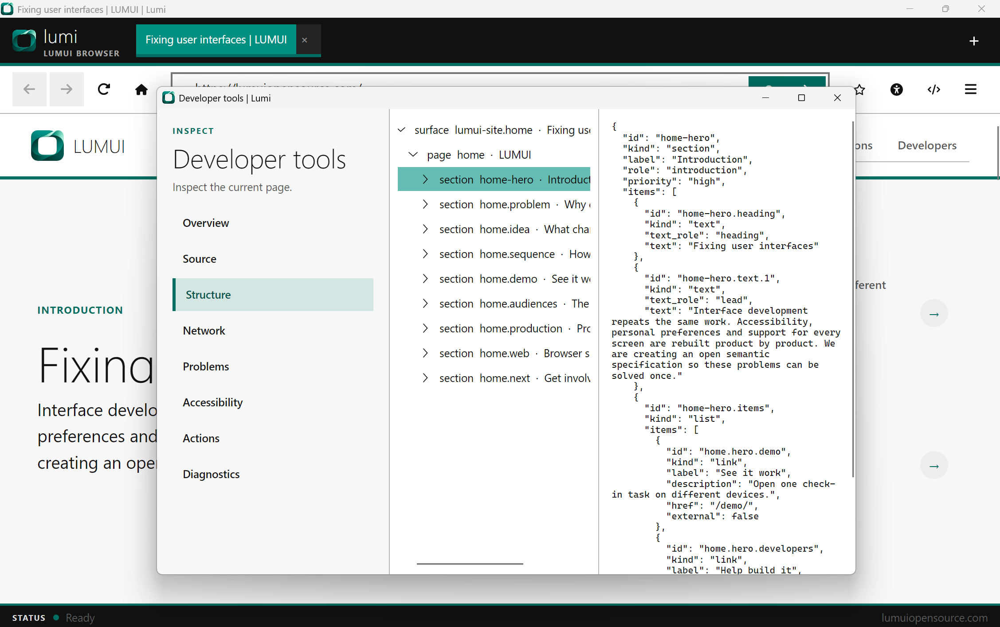
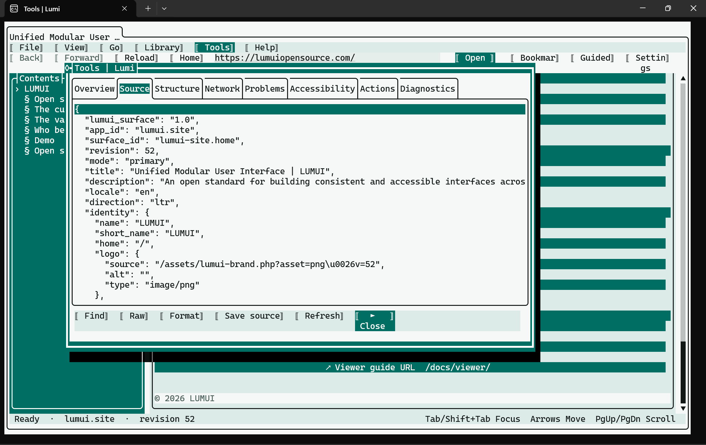

# LUMUI Reference Browsers

**Reference browsers for LUMUI.**

This repository contains standalone browser and renderer implementations for the LUMUI specification. Each implementation demonstrates one possible presentation of the same semantic application model. No implementation is canonical or more important than another.

| C# with Avalonia | C# with Terminal.Gui |
| --- | --- |
|  |  |
|  |  |
| Native desktop controls, window management and graphical developer tools. | Keyboard-first terminal controls, dialogs, menus and terminal media presentation. |
| [Open the Avalonia implementation](Source/CSharp/Avalonia/) | [Open the Terminal.Gui implementation](Source/CSharp/TerminalGui/) |

Both current implementations support navigation, tabs, history, bookmarks, downloads, credential storage, accessibility preferences, developer inspection and semantic component rendering. They request validated LUMUI documents directly and do not embed an HTML browser engine.

## Repository structure

```text
Source/
  CSharp/
    Avalonia/       Avalonia browser and solution
    TerminalGui/    Terminal.Gui browser and solution
    Shared/         Shared C# protocol client
  resources/        Versioned LUMUI schemas and component data
```

Future implementations can be added beside `CSharp` in their own language or platform directory. Examples may use Python, WPF, mobile frameworks, kiosk toolkits or other suitable technologies.

## Build and run

The current C# implementations require Windows and the .NET 10 SDK. Each solution can be restored, built and run independently.

### Avalonia

```sh
cd Source
dotnet restore CSharp/Avalonia/Lumui.Avalonia.sln
dotnet run --project CSharp/Avalonia/Lumui.Browser -- https://lumuiopensource.com/
```

### Terminal.Gui

```sh
cd Source
dotnet restore CSharp/TerminalGui/Lumui.TerminalGui.sln
dotnet run --project CSharp/TerminalGui/Lumui.Cli -- https://lumuiopensource.com/
```

## Native AOT publishing

```sh
cd Source
dotnet publish CSharp/Avalonia/Lumui.Browser/Lumui.Browser.csproj -p:PublishProfile=win-x64-aot
dotnet publish CSharp/TerminalGui/Lumui.Cli/Lumui.Cli.csproj -p:PublishProfile=win-x64-aot
```

The Avalonia and Terminal.Gui executable projects enable Native AOT, trimming analysis and generated JSON metadata.

## Specification resources

A versioned snapshot of the normative LUMUI resources, including the [component specification](Source/resources/lumui/lumui-components.md), is included for deterministic builds. The canonical resources are maintained in the [LUMUI repository](https://github.com/Open-System-Query/lumui).

## License

The reference browsers are released under the [MIT License](LICENSE) by [Open System Query](https://opensystemquery.nl/).
